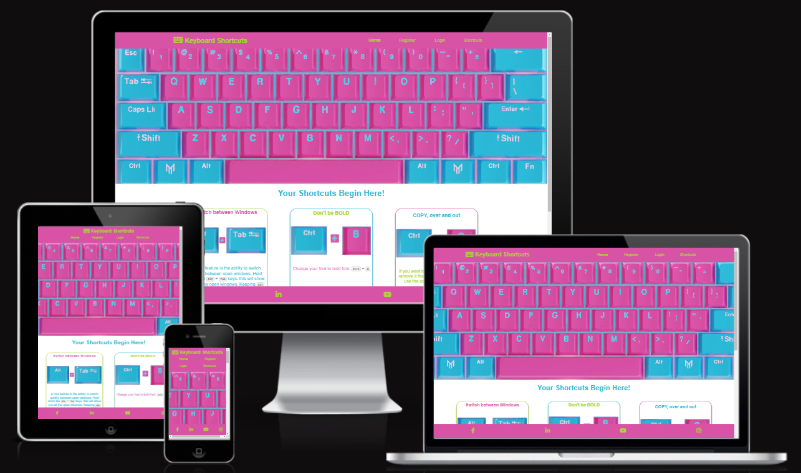
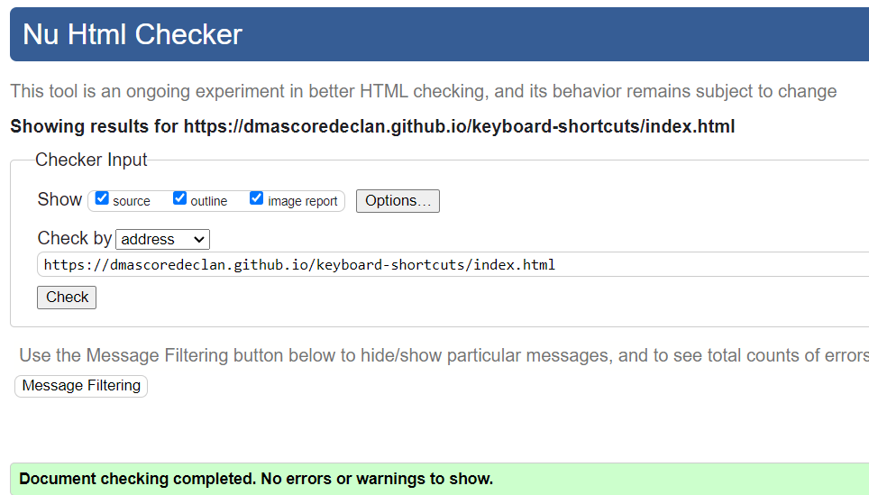
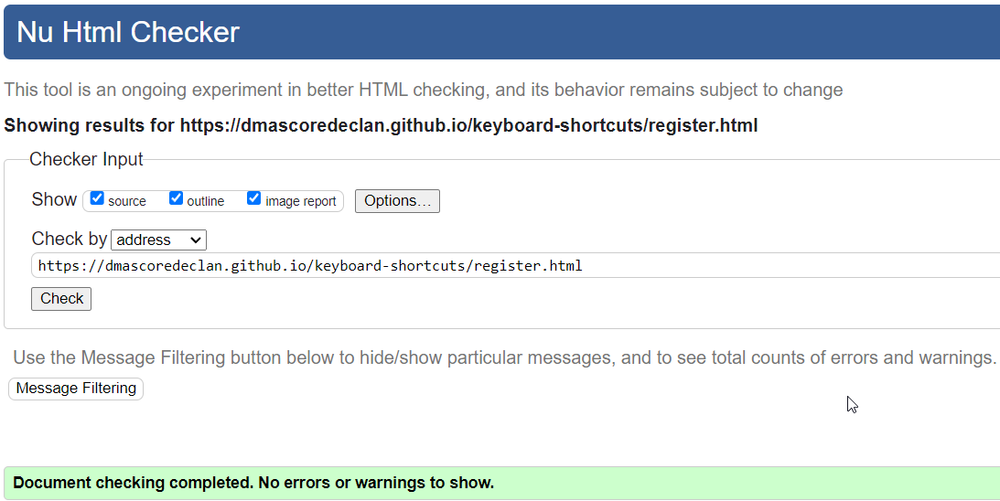
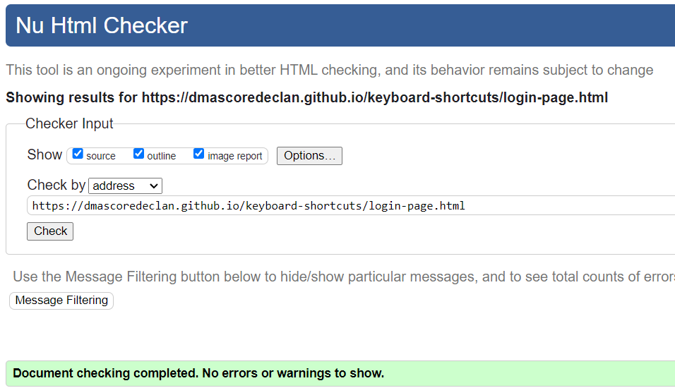
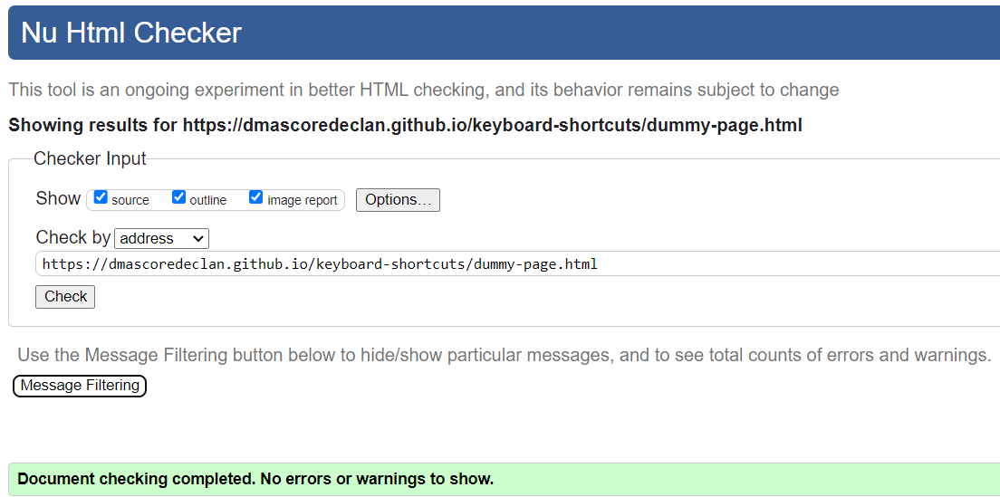
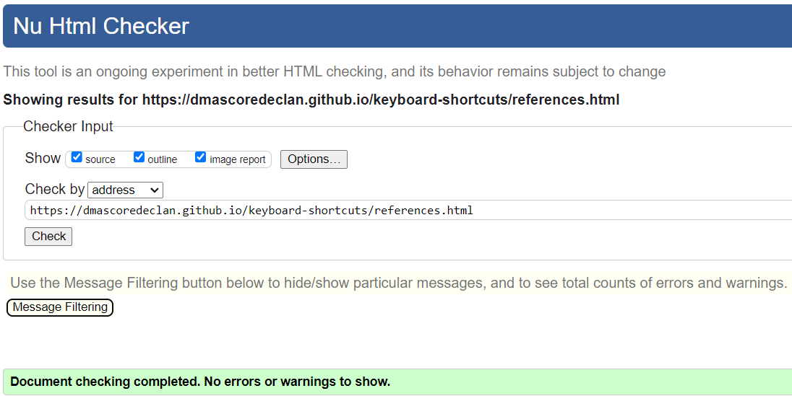
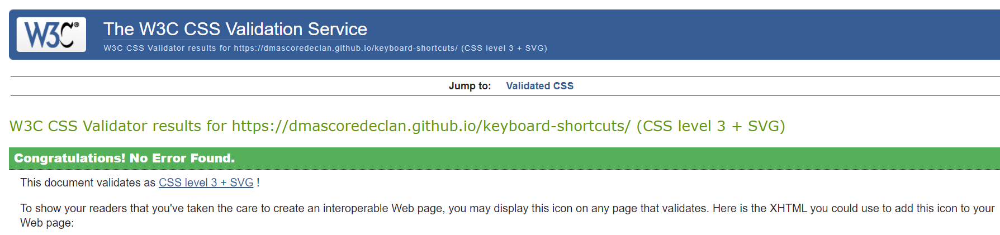

The site URL is: https://dmascoredeclan.github.io/keyboard-shortcuts/index.html

Only 4 of the pages are visible from the Nav Bar.  dummy-page.html, simulates someone leaving the site after REGISTERING and clicking on an email verification link to be brought back to the site to LOGIN.

I wanted the site to be a bit whimsical and playful in terms of colors and I wanted to demonstrate my ability to make the site responsive.

Features that I would like to have but am currently unable to code are the ability for someone to contribute a Shortcut Tip through a form that would be displayed on the HOME page in the format of the current Home Page.

What I learned from this project is that DESIGN is the key to rapid development.  Once you know what you're trying to achieve, its much easier to code the HTML and CSS.  I also learned, keep it simple.

The last update to this file was: **June 10th, 2023**

## Keyboard-Shortcuts Validations:

This is my Code Institute Project 1 assignment.  This sites 5 pages have been validated with (https://validator.w3.org/).  
Here are the results for the: (https://dmascoredeclan.github.io/keyboard-shortcuts/index.html) 

Here are the results for the: (https://dmascoredeclan.github.io/keyboard-shortcuts/register.html) 

Here are the results for the: (https://dmascoredeclan.github.io/keyboard-shortcuts/login-page.html) 

Here are the results for the: (https://dmascoredeclan.github.io/keyboard-shortcuts/dummy-page.html) 

Here are the results for the: (https://dmascoredeclan.github.io/keyboard-shortcuts/references.html) 

Here are the results for the CSS Validation: 

To run a frontend (HTML, CSS, Javascript only) application in Codeanywhere, in the terminal, type:

`python3 -m http.server`

A button should appear to click: _Open Preview_ or _Open Browser_.

To run a frontend (HTML, CSS, Javascript only) application in Codeanywhere with no-cache, you can use this alias for `python3 -m http.server`.

`http_server`

To run a backend Python file, type `python3 app.py`, if your Python file is named `app.py` of course.

A button should appear to click: _Open Preview_ or _Open Browser_.

In Codeanywhere you have superuser security privileges by default. Therefore you do not need to use the `sudo` (superuser do) command in the bash terminal in any of the lessons.

To log into the Heroku toolbelt CLI:

1. Log in to your Heroku account and go to _Account Settings_ in the menu under your avatar.
2. Scroll down to the _API Key_ and click _Reveal_
3. Copy the key
4. In Codeanywhere, from the terminal, run `heroku_config`
5. Paste in your API key when asked

You can now use the `heroku` CLI program - try running `heroku apps` to confirm it works. This API key is unique and private to you so do not share it. If you accidentally make it public then you can create a new one with _Regenerate API Key_.

---

Happy coding!
