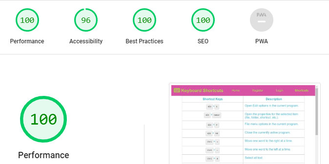

Keyboard-Shortcuts is a site for people who want to learn ways of becoming faster coders by knowing the ShortcutKeys instead of using a Mouse!  

The site URL is: https://dmascoredeclan.github.io/keyboard-shortcuts/index.html

The site has 5 pages.  Only 4 of the pages are visible from the Nav Bar.  dummy-page.html, simulates someone leaving the site after REGISTERING and clicking on an email verification link to be brought back to the site to LOGIN.

I wanted the site to be a bit whimsical and playful in terms of colors and I wanted to demonstrate my ability to make the site responsive.

What I learned from this project is that DESIGN is the key to rapid development.  Once you know what you're trying to achieve, its much easier to code the HTML and CSS.  I also learned, keep it simple.

The last update to this file was: **June 10th, 2023**

## Keyboard-Shortcuts Validations:
### Lighthouse Score:

## Accessibility improvement
The color pickers support these colors working together and were color picked from the original HERO Image, I decided to keep with the colors picked by a professional, ratherthan changing it.

### HTML Validation Results:
This is my Code Institute Project 1 assignment.  This sites 5 pages have been validated with (https://validator.w3.org/).  
Here are the results for the: (https://dmascoredeclan.github.io/keyboard-shortcuts/index.html) 

Here are the results for the: (https://dmascoredeclan.github.io/keyboard-shortcuts/register.html) 

Here are the results for the: (https://dmascoredeclan.github.io/keyboard-shortcuts/login-page.html) 

Here are the results for the: (https://dmascoredeclan.github.io/keyboard-shortcuts/dummy-page.html) 

Here are the results for the: (https://dmascoredeclan.github.io/keyboard-shortcuts/references.html) 

### CSS Validation Results:
Here are the results for the CSS Validation: 

## Keyboard-Shortcuts Features:
This site has a home page that gives a taste of they types of screenshots that are helpful.  However, it encourages you to Contribute by having a Register and a Login page.  Features that I would like to have but am currently unable to code are the ability for someone to contribute a Shortcut Tip through a form that would be displayed on the HOME page in the format of the current Home Page.

## Testing
Manual testing has enusred that the FORMs work at all viewport sizes and that HOVERing on the footer elements works when there is a seperate physical keyboard, (HOVERing does not feature with touch screens).  

## Bugs
There are no remaining bugs as far as I can identify.  Bugs that arose throughout were primarily around the use of FLEX, which took me 2 weeks to conquer.  Other bugs were incorrect relative referencing and incorrect cases sensitivity for the PNGs in the site.

## Credits:
### Content
Table Contents for references.html were taken from: https://www.computerhope.com/shortcut.htm
### Media
Hero Image: (https://matrixkeyboards.com/products/cotton-candy-elite-series-60-keyboard?pr_prod_strat=use_description&pr_rec_id=edf21c026&pr_rec_pid=8148847755501&pr_ref_pid=7768254841069&pr_seq=uniform)

